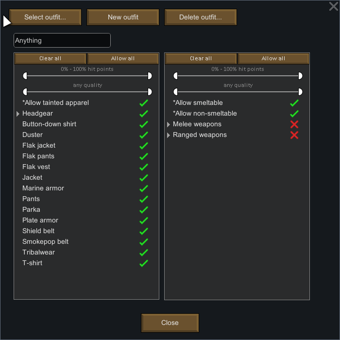

# Rimworld_WeaponsAndOutfits
Mod that gives the possibility to assign weapons to outfits, just like apparel

Description of the mod:

Description of the mod:

Just like the apparel filter you have in the outfit's dialog menu, you will have one for weapons (equipment).Quality and hitpoints percentage filters works for this too . The idea is to just pick a few from the filter so that you can switch weapons quickly when raided (like hunter outfit -> Battle outfit) etc.

The pawn then will check if he is equipping that weapon. If true he will do nothing, otherwise he will look for the first weapon in his filter list available to pick up from storages. He will just go to the weapon, throw the one he is equipping, equip the desired one, and opportunistically will haul the weapon to the correct storage

Compatibility:

I have tested it quite a while with this modlist and had no problems:

<activeMods>
    <li>Core</li>
    <li>HugsLib</li>
    <li>BetterPawnControl</li>
    <li>PathAvoid</li>
    <li>While You are Up</li>
    <li>PickUpAndHaul</li>
    <li>P-Music</li>
    <li>HeatMap</li>
    <li>MedicalTab</li>
    <li>AvoidFriendlyFire</li>
    <li>Pharmacist</li>
    <li>RimworldSearchAgency</li>
    <li>AreaUnlocker</li>
    <li>Miscellaneous_TrainingFacility</li>
    <li>PriorityClean</li>
    <li>MoreHarvestDesignators</li>
    <li>kNumbers</li>
    <li>Blueprints</li>
    <li>GearUpAndGo</li>
    <li>SnapOut</li>
</activeMods>

It greatly benefits from BetterPawnControl as you can imagine.
---------------------------------------------------------------
Incompatibility:
It might not be compatible with Outfitted

---------------------------------------------------------------
Credits-
Rimworld's Discord Mod Development channel  for all the help regarding modding the game :)
NotFood's Outfitted code as the spiritual guide :P

---------------------------------------------------------------
Github: https://github.com/ErnestUTN/Rimworld_WeaponsAndOutfits
